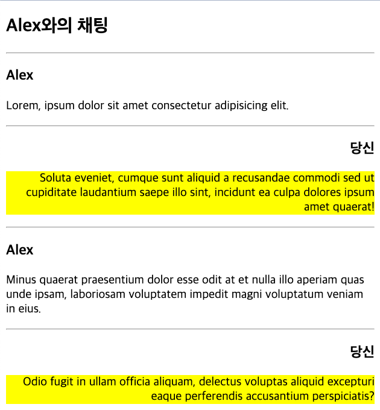
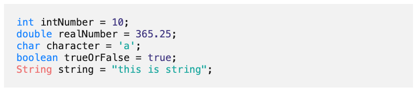
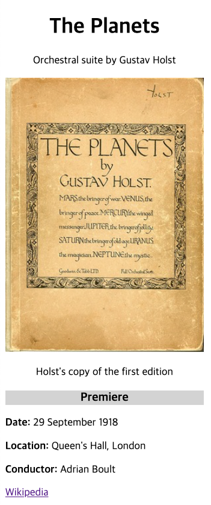

# CSS 기초 연습하기

## P1

HTML을 참고하여, 주어진 그림과 동일한 모습이 되도록 CSS를 작성하세요.

## P2

CSS를 참고하여, 주어진 그림과 동일한 모습이 되도록 HTML을 수정하세요.

## P3

다음 그림 유사한 UI를 주어진 HTML과 CSS를 이용해 작성하세요.
주어진 이미지를 활용하시고, 링크의 주소는 `https://en.wikipedia.org/wiki/The_Planets`로 적용하세요.

